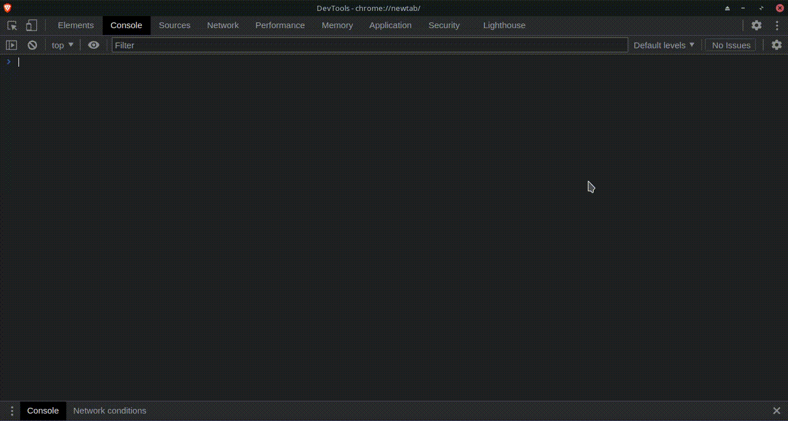

# Math Grapher

Draw functions and programatically generated drawings on a cartesian canvas.

## Instrucitons
Run main.js on the browser devtools. Then use the classes as shown in the example. Custom drawings can be created using the Drawing class.

### Example 1
```javascript
const fig = new Figure()
fig.setInDocument()

fig.addFunction(new Function(fig, [
  { f: x => Math.sin(x ** 2), interval: '[1, 3]' },
  { f: x => x - 3 + Math.sin(3 ** 2), interval: '(3, 5)' },
  { f: x => 4, interval: '[6, 8)' },
], 'red'))

const M = new Methods(fig)
M.bisection(fig.functions.get('F0'), [1.8, 3.8])
```


### Example 2
```javascript
const f = new Function(fig, x => Math.sin(x)+0.8, 'red')
const df = new Function(fig, x => Math.cos(x), 'orange')
const ddf = new Function(fig, x => -Math.sin(x), 'blue')
fig.addFunction(f, 'f')
fig.addFunction(df, 'df')
fig.addFunction(ddf, 'ddf')

M.newton({interval: [3.25, 4.5], f, df, ddf, precision: 1e-12, iterDelay: 2000})
```
